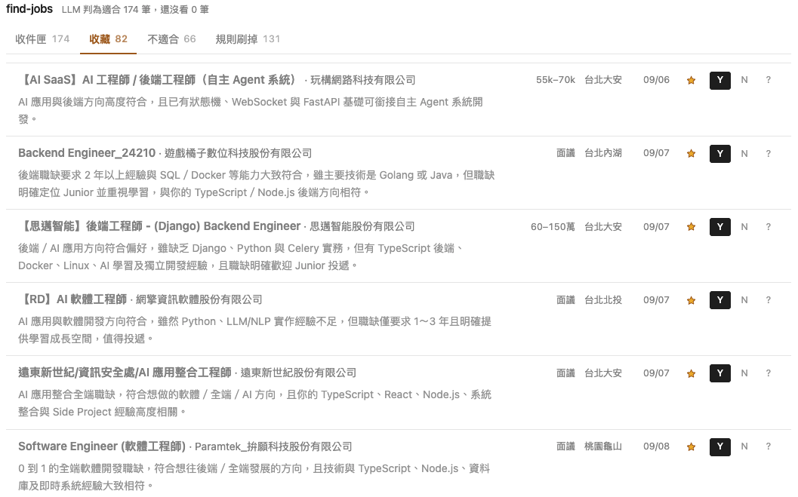
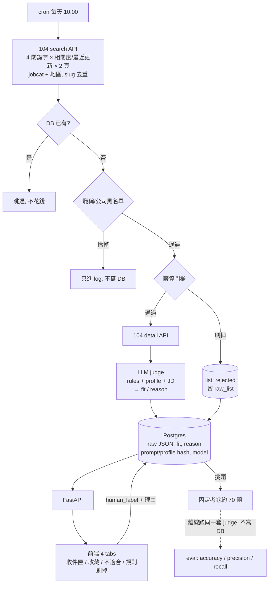

# find-jobs

個人使用的小工具：每天自動根據特定關鍵字抓 104 職缺，用 LLM 依我的 profile 判斷適不適合投，結果存進 Postgres，前端根據判斷的結果分成不同的 tab 顯示職缺

## 介面

## 流程

## Tech Stack

Python｜FastAPI + psycopg｜Postgres 18
React + TypeScript + Tailwind｜OpenAI Responses API

跑在自己的 VPS：Docker Postgres、cron、systemd + nginx basic auth + TLS

## Eval

目前約 70 筆固定職缺 ＋ 我標註的答案，存成 `dataset.jsonl` 用 git 管，每一版 prompt 都跑同一份

每次跑 `eval.py` 的結果附一行到 `history.tsv`，記下 prompt / profile / dataset 的內容 hash 和 model 名稱，分數才知道能不能互相比。

原本的 prompt 幾乎不會漏（recall 1.00），但判適合的有一半不適合。做法是把「LLM 判適合、
我標不適合」的職缺撈出來歸類，把共同點寫回 rules / profile 。recall 掉一點，precision 提高不少。

| 同一份考卷   | accuracy | precision | recall |
| ------------ | -------- | --------- | ------ |
| 改 prompt 前 | 0.62     | 0.54      | 1.00   |
| 改 prompt 後 | 0.9      | 0.9       | 0.88   |

## 幾個設計決定

- **每筆職缺都存 `prompt_sha256` / `profile_sha256` / `model`。** 任何一筆都查得出是哪個版本判的，
  也是重判時「跳過已經用當前版本判過的」的依據 —— 中途斷掉重跑不會重複花錢。
- **便宜的過濾放前面。** search API 帶 `jobcat` + 職稱/公司黑名單 regex，減少送進 LLM 的量。
- **JD 原始 JSON 整份存成 JSONB。** 職缺可能會下架，重判和擴充考卷都直接讀 DB。
